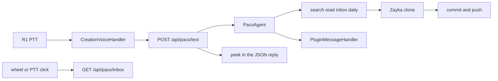

# Paco, Zayka on the R1

Date: 2026-09-22

Paco is a second Rabbit R1 creation for the Zayka vault. Tito stays the calendar butler. Paco captures fleeting notes and answers short orientation questions. Deep work on evergreen notes stays in a later chat with a stronger model.

See also [zayka-data-source.md](../zayka-data-source.md) and [2026-09-19-r1-talk-home-design.md](2026-09-19-r1-talk-home-design.md).

## Goal

Hold PTT, speak, get one or two spoken sentences back.

- "Write this down" creates a fleeting note in `00 Inbox/` and pushes it to `easypizi/zayka`.
- "Add this to today's daily" appends a capture block to today's daily note and pushes it.
- "Where did I put HireScope?" searches allowed notes and shows hits in the peek. Speech does not read the list aloud.

## Out of scope

- Evergreen, source, project, area, MOC, and `100 AI-Generated/` notes.
- Editing or deleting any note.
- Inbox processing (fleeting to evergreen).
- Telegram, a second bot, or a second Heroku app.
- Todoist and Google Calendar.
- Whisper and `gpt-4o-mini-tts` on the R1 path.
- GitHub Pages for this creation. `CREATION_PUBLIC_URL` does not change Paco's install URL.

## Hosting

Same Heroku app `toy-lair-assistant`. Same `X-Assistant-Token`. Same in-memory pairing (`/api/pair/*`). Paco stores the token in its own `creationStorage`. Tito's storage is untouched.

The device still runs one creation at a time. The repo hosts two. The user switches in the Creations list. Do not load both UIs in one WebView.

| Piece | Path |
| --- | --- |
| Creation UI | `rabbit/paco/` |
| Served at | `/creation/paco/` and `/creation/paco/v2/` |
| Install QR payload URL | `{heroku origin}/creation/paco/v2/` |
| Agent | new `PacoAgent`, not `Agent._system_prompt` |
| Text | `POST /api/paco/text` |
| Peek when idle | `GET /api/paco/inbox` |
| Icon | `GET /paco.png` |

`creation_dir()` keeps serving Tito from `rabbit/assistant/`. Paco gets its own directory resolver. Cache-Control on `/creation/paco` matches `/creation` (`no-cache`).

QR JSON title is `Paco`. `iconUrl` is `/paco.png`, not `/i.png`. `GET /api/paco/install-qr.png` is public, same as Tito's `/api/install-qr.png`. `GET /api/paco/install-qr.svg` stays behind the token. These routes are not Tito's QR, so a scan cannot install Tito.

`POST /api/text` always hits Tito. `POST /api/paco/text` always hits Paco. Client logs stay on `POST /api/client-log` with event names prefixed `paco `.

Paco starts when the Zayka clone exists and `OPENAI_API_KEY` is set. It does not wait for Todoist or Calendar. Reuse `OPENAI_MODEL` (`gpt-4.1-mini`).



## Screen (240x282)

Talk home, same shell as Tito.

- Title `Paco`, 20px icon, status, inbox count, last reply, 64px rec circle (`#FE5000` pulse while listening).
- Assets: `rabbit/paco/paco.png` and `rabbit/paco/icon.png`, 512x512 PNG, same pixel treatment as `rabbit/assistant/tito.png`.
- Hint: `hold PTT · wheel inbox`.
- Replies over 120 characters use `.long` (13px). If the reply overflows and peek is closed, the wheel scrolls it by 40px.
- Pairing code on first launch. Token written to secure, plain, and local storage after the Flutter bridge appears.

`#peek` stays hidden until the wheel, a PTT click, or a reply with `kind: hits`. A row click does not write, open, or delete.

Peek contents:

- Opening the peek from closed (wheel or PTT click) always loads `GET /api/paco/inbox`. That list is inbox notes, newest first. Skip `00 Inbox/00 Inbox.md`.
- Hold PTT closes the peek before listen. When the reply comes back, `kind: hits` opens the peek on those items. `kind: inbox` leaves the peek closed and refreshes the inbox count.
- `zayka_search` is the only tool that sets `kind: hits`. Any other turn sets `kind: inbox`.
- Closing the peek drops hits. The next open is inbox again.

`POST /api/paco/text` returns `{ "reply", "peek": { "kind": "inbox" | "hits", "items": [] } }`.

Inbox item: `{ "title", "age_hours", "tags" }`. Hit item: `{ "path", "title", "snippet" }`. `tags` includes `to-process` when the note has that tag. The row shows `#to-process` only then.

## Voice

Match live Tito, not the old `getUserMedia` hello screen.

1. Hold PTT or `#rec` sends `CreationVoiceHandler` `start`. Release sends `stop`.
2. `sttEnded` transcript goes to `POST /api/paco/text`.
3. Speak `reply` with `PluginMessageHandler` (`useLLM: false`, `wantsR1Response: true`).
4. No `POST /api/voice`. No OpenAI transcription. No OpenAI speech. Rabbit STT and TTS are free on this path. Tokens are only the chat model.
5. Missing voice bridge shows `no voice bridge (open on r1)` and beacons `paco no voice bridge`.
6. If `sttEnded` has not arrived 15s after stop, show `stt timeout`.

PTT click toggles the peek. The wheel opens the peek, then scrolls it. Hold PTT closes the peek and listens.

Spoken replies are one or two sentences, plain text, no markdown. Do not read the catalog. Many hits become "Three notes, look at the peek." After a write, say `Wrote to Inbox: <title>` or `Added to daily`. On git failure, say the failure. Do not claim the note was saved.

## Agent

System prompt, English, no butler persona:

```
You are Paco.
Now: {YYYY-MM-DD HH:MM} {zone}.
Fleeting notes go to 00 Inbox and should be processed within 48 hours.
One note is one idea.
Write the dictated thought in the user's words. Do not turn it into an essay.
Link with [[wikilinks]] only to notes that exist.
Workflow tags only: #draft #review #evergreen #idea #to-process #waiting. No topic tags.
Do not mix languages inside one sentence. Technical terms stay in English.
New filenames are kebab-case ASCII. No spaces. No Cyrillic.
Inbox should stay at or under 20 notes. If it is over, say so.
Answer in the language of the user's request.
Inbox:
{up to 15 lines: title · Nh}
Daily today: {path or none}
MOCs: {names only}
```

Do not paste `Methodology - Zettelkasten.md` or note bodies into the prompt. Inbox lines are the 15 newest fleeting files. If the inbox has more than 20 notes, add one line `Inbox count: N (over 20)`.

Age is whole hours from file mtime in `TIMEZONE` (default `America/Los_Angeles`). If mtime is missing, use frontmatter `date` at 00:00 in that zone.

Tools:

| Tool | Behavior |
| --- | --- |
| `zayka_search` | Allowed notes only. Cap 8 hits. Snippet is enough. Do not `read` just to answer. |
| `zayka_read` | Allowed path only. Else `blocked`. Return frontmatter, markdown headings, and the first 2000 characters of the body. If the body was cut, append `truncated`. |
| `zayka_list_inbox` | Same 15 rows as the prompt, plus `inbox_count`. |
| `zayka_inbox_create` | New fleeting file. See Write. |
| `zayka_daily_append` | Append to today's daily. See Write. |

No calendar tools. No Todoist tools. Tool loop stops at 4 rounds.

Routing:

- A capture with no daily cue always calls `zayka_inbox_create`. Cue examples: "запиши", "идея", "в inbox", "write this down".
- A daily cue calls `zayka_daily_append`. Cue examples: "в дневник", "в daily", "today's note".
- If the destination is unclear, use Inbox.
- Evergreen, project, edit, or delete: refuse in one sentence. Do not call a write tool.

Optional `related`: zero to two wiki targets. The server drops any target whose filename stem is not in the allowed index (case-insensitive). The model cannot create a broken link. Do not link into a blocked path.

Memory: channel `r1-paco`, last 6 turns, 15 minutes, same store as Tito. No confirm word before create or append.

## What Paco may read

Tito's allow-list plus inbox and daily:

- `00 Inbox/`
- `10 Evergreen/`
- `30 Projects/`
- `40 Areas/` except `40 Areas/sensitive/`
- `50 MOC/`
- `60 Daily/`
- `Home.md`

Blocked everywhere: `40 Areas/sensitive/`, `.obsidian/`, `.smart-env/`, `.git/`, `Presentations/`. A search hit that would open a blocked path is skipped.

## Write

Only two paths. Anything else is refused before git runs.

1. A new file `00 Inbox/YYYY-MM-DD-short-title.md`. Never `00 Inbox/00 Inbox.md`. Never overwrite. If the name exists, use `-2`, then `-3`.
2. Today's daily `60 Daily/YYYY/MM/YYYY-MM-DD.md` in `TIMEZONE`. Create it if missing. If it exists, append only.

Do not write `60 Daily/Дневник/`. Those `DD.MM.YYYY` files are the old diary. Do not write `60 Daily/brainteasers.md` or `60 Daily/60 Daily.md`.

### Inbox file

Match `90 Templates/template-fleeting.md`. Fill every placeholder.

```yaml
---
id: YYYYMMDDHHMMSS
title: ""
date: YYYY-MM-DD
type: fleeting
status: draft
tags: [to-process]
related: []
---
```

Body: one short paragraph of the dictated thought, then:

```markdown
## Next step
- [ ] Обработать до: YYYY-MM-DD
```

The date is today + 2 days in `TIMEZONE`. `title` may follow the user's language. The filename may not.

Filename: model proposes a short title. Server lowercases, turns spaces and punctuation into hyphens, strips non-ASCII. Empty result becomes `capture`. Example: `2026-09-22-hire-scope-idea.md`.

`related` is a YAML list of stems that survived the allow-list check. Use `related: []` when nothing matched. Do not add a `## Related` section. The fleeting template has no body links.

### Daily file

Missing file: fill `90 Templates/template-daily.md`, then append the capture. Frontmatter `id` is `YYYYMMDDHHMMSS`, `title` is the date, `date` is `YYYY-MM-DD`, `type: daily`, `status: draft`. The H1 is a Russian weekday and a Russian month in the genitive, for example `Вторник, 22 сентября 2026`. Weekdays: понедельник, вторник, среда, четверг, пятница, суббота, воскресенье. Months: января, февраля, марта, апреля, мая, июня, июля, августа, сентября, октября, ноября, декабря. Do not depend on the dyno locale. Leave the template's empty sections in place.

Existing file: do not change earlier bytes. Append:

```markdown
## Capture HH:MM
<text>
```

`HH:MM` is local in `TIMEZONE`. The capture text follows the utterance. One language per sentence.

### Git

On the dyno, in `ZAYKA_DIR`:

1. `git pull --ff-only`. On failure, write nothing. Say the vault is ahead or the pull failed.
2. Write the one file.
3. `git add -- <relative-path>` for that file only. Reject `..` and any path outside the two patterns above. Do not stage `40 Areas/sensitive/`, `.obsidian/`, or `.smart-env/`.
4. Commit with a one-shot author, not `git config`:

   `git -c user.name=Paco -c user.email=paco@toy-lair commit --only -- <relative-path>`

   `--only` keeps other staged files out of the commit. Inbox message: `Capture: <title>`. Daily message: `Daily: YYYY-MM-DD`.
5. `git push`. On failure, say the push failed. Do not say the note was saved. The local commit stays in the clone. A later successful push sends it. Do not rebase. Do not force-push.

`ZAYKA_REPO_URL` must be able to push. The current boot clone is read-only. Tests use a fake git runner and must not push.

The Mac vault updates with a normal pull. Paco does not touch `~/Documents/Zayka` directly when it is running on Heroku.

## Tests

- Allow-list: sensitive, `.obsidian`, `Presentations/`, and `..` cannot be read or written.
- Search never returns a blocked path.
- Inbox create writes the fleeting template, `#to-process`, and a +2 day next step.
- Name collision uses `-2`. `00 Inbox.md` is not a capture.
- Daily append on an existing file only adds a `## Capture` block.
- Missing daily is created from the template, then the capture is appended.
- Paths under `60 Daily/Дневник/` are not write targets.
- Broken wiki targets are stripped before write.
- Fake git runner: pull failure writes nothing. Push is not invoked in pytest.
- `git add` receives only the one relative path.
- `POST /api/paco/text` without the token is 401.
- `PacoAgent` constructs with Zayka and no Todoist or Calendar.
- `/api/text` does not call Paco. `/api/paco/text` does not call Tito.

## Docs and config during implementation

- Update [zayka-data-source.md](../zayka-data-source.md): Paco may write Inbox and today's daily. Tito stays read-only. `40 Areas/sensitive/` stays unread.
- Note in [devices/rabbit-r1/README.md](../../devices/rabbit-r1/README.md) that two creations can be installed and only one runs at a time.
- Heroku: replace the read-only deploy key with a push-capable URL in `ZAYKA_REPO_URL`. No new app, no new token.

## Implementation order

1. Path allow-list and write tests on a temp vault.
2. `PacoAgent` prompt, tools, and `/api/paco/text` with a fake git runner.
3. `rabbit/paco/` Talk home pointed at those routes, native STT and TTS.
4. QR and `/paco.png`.
5. Real push only after the write tests pass and the deploy key can push.
